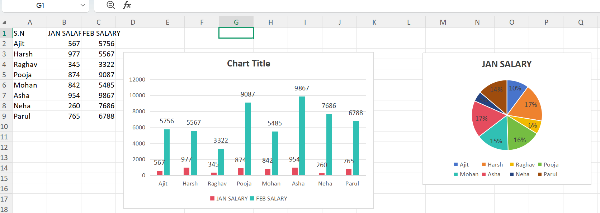

# Excel Sales Dashboard & Data Analytics Project

Hi! This repository contains my full Excel data analytics work. I started with dynamic formulas and built it up to an interactive Executive Sales Dashboard across multiple sheets.

---

## 🚀 Project Architecture (All 5 Sheets Included)

To explore the live formulas and interactive slicers, please download **`Excel_Practice (1).xlsx`**. Inside the workbook, you will find these 5 specific sheets:

1. 📊 **`DASHBOARD`**: The main presentation view featuring interactive Column and Pie charts.
2. 📝 **`PROJECT_EXCEL`**: The cleaned raw data sheet utilizing advanced conditional formatting.
3. 📦 **`PRODUCT_SALES`**: Backend analytics sheet leveraging Pivot Tables by product categories.
4. 🏙️ **`CITY_SALES`**: Geographical data breakdown sheet tracking revenue across different cities.
5. 👥 **`CUSTOMER_SALES`**: Customer-centric analysis sheet mapping buyer patterns.

---

## 🖼️ Project Sheets & Dashboard Previews
*(Yahan mere project ke saare sheets ki images hain)*

### 1. Main Dashboard View (Column & Pie Charts)

### 2. Live Sheet View

### 3. Product Sales Analytics Sheet

### 4. City Sales Distribution Sheet

### 5. Customer Sales Report Sheet

---

## 🛠️ Advanced Excel Skills Demonstrated
* **Data Modeling:** Connected datasets across sheets using **XLOOKUP** and **INDEX-MATCH**.
* **Formulas:** Used **SUMIFS**, **COUNTIFS**, and logical operators for dynamic tracking.
* **Interactive UI:** Implemented **Pivot Charts**, **Slicers**, and **Timeline Filters** for seamless user navigation.

---
*Please download **`Excel_Practice (1).xlsx`** to test the interactive slicers and formulas live!*

